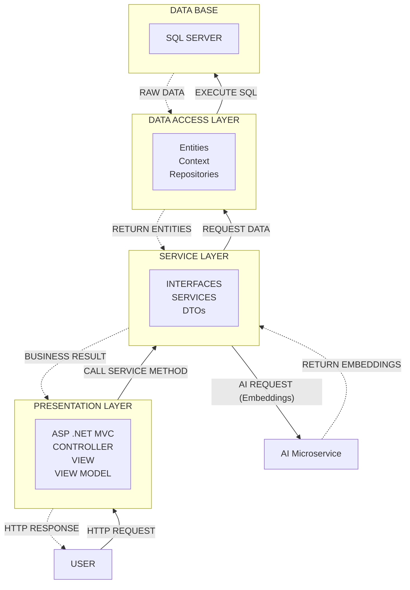

# Chatbot RAG System

This repository contains an ASP.NET Core web application integrated with a Python-based AI microservice to provide a Retrieval-Augmented Generation (RAG) chatbot system. It features real-time chatting, document processing, and role-based access control.

## 🚀 Project Architecture

The application is built using a clean N-Tier architecture:

## 📁 Code Structure

The solution `Assignment1.sln` consists of four main components/folders:

### 1. `DataAccessLayer`
Handles all interactions with the SQL Server database using Entity Framework Core.
* **`Context/`**: Contains the `ChatbotDbContext` and configuring database relations.
* **`Entities/`**: Database models (e.g., `ChatMessage`, `ChatSession`, `Document`, `DocumentChunk`, `Subject`, `AspNetUser`).
* **`Migrations/`**: Entity Framework Core migration files.
* **`Repositories/`**: Implements the Repository pattern for data access logic (`DocumentRepository`, `ChatSessionRepository`, etc.).

### 2. `ServiceLayer`
Contains the core business logic of the application.
* **`DTOs/`**: Data Transfer Objects used to safely pass data between layers.
* **`Interfaces/`**: Abstractions for services to ensure loose coupling.
* **`Services/`**: Core implementations including:
  * `ChatService`: Manages chat sessions and messages.
  * `DocumentService` & `ChunkingService`: File processing and text splitting.
  * `RagService`: Orchestrates the Retrieval-Augmented Generation logic.
  * `TextExtractorService`: Extracts text from documents.
  * `SubjectService` & `BenchmarkService`: Administration of subjects and AI evaluation.

### 3. `PresentationLayer`
The frontend web application built with ASP.NET Core MVC/Razor Pages.
* **`Controllers/`**: Routes HTTP requests and coordinates actions (`ChatController`, `DocumentController`, `AdminController`).
* **`Views/`**: The Razor UI templates for the frontend.
* **`ViewModels/`**: Models specifically structured for views.
* **`Areas/Identity/`**: Manages Authentication and Authorization (ASP.NET Core Identity & Google OAuth).
* **`wwwroot/`**: Static assets like CSS, JavaScript, Bootstrap, jQuery, and stored uploads.

### 4. `PythonAIService`
A standalone Python FastAPI microservice responsible for creating vector embeddings.
* **`main.py`**: A FastAPI application leveraging the `sentence-transformers` library (`intfloat/multilingual-e5-base`) to convert text into vector representations.
* **`requirements.txt`**: Python dependencies (FastAPI, uvicorn, sentence-transformers, etc.).

## 🛠️ Technology Stack
* **Backend**: C#, .NET 8, ASP.NET Core, Entity Framework Core.
* **Frontend**: HTML, CSS, JavaScript, Bootstrap.
* **Database**: SQL Server.
* **AI Service**: Python 3, FastAPI, Uvicorn, Sentence Transformers.
