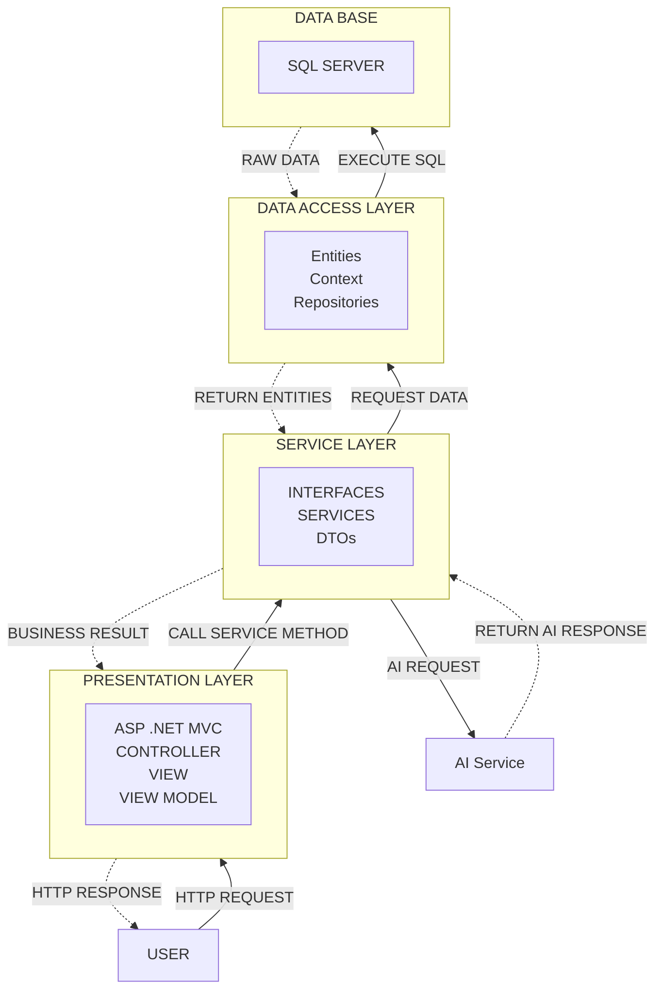

# Chatbot RAG System (PRN222 Assignment)

This repository contains an ASP.NET Core web application integrated with a Python-based AI microservice to provide a Retrieval-Augmented Generation (RAG) chatbot system. It features real-time chatting, document processing, and role-based access control.

## 🚀 Features
* **N-Tier Architecture**: Clean separation of concerns with Presentation, Service, and DataAccess layers.
* **Real-time Chat**: Powered by ASP.NET Core SignalR for seamless communication.
* **Retrieval-Augmented Generation (RAG)**: Integrates with an AI embedding microservice to ground chatbot responses in uploaded documents.
* **Document Management**: Upload, extract, and chunk documents to serve as knowledge bases for the AI.
* **Python AI Microservice**: A FastAPI application leveraging `sentence-transformers` (`intfloat/multilingual-e5-base`) to generate dense vector embeddings.
* **Authentication & Authorization**: Includes ASP.NET Core Identity with Google OAuth integration and role-based access (Admin/User).
* **Database Management**: Entity Framework Core with SQL Server.

## 🏗️ Architecture



## 📁 Project Structure
* **`PresentationLayer/`**: The ASP.NET Core Razor Pages frontend, Hubs (SignalR), and application configuration.
* **`ServiceLayer/`**: Business logic, including Chat, Document Processing, RAG orchestration, and Text Extraction.
* **`DataAccessLayer/`**: Entity Framework Core DbContext, Repositories, and Database Entities.
* **`PythonAIService/`**: A FastAPI microservice responsible for generating vector embeddings for the RAG pipeline.

## 🛠️ Tech Stack
* **Backend**: C#, .NET 8, ASP.NET Core, SignalR, Entity Framework Core.
* **Frontend**: Razor Pages, HTML/CSS/JS.
* **Database**: SQL Server.
* **AI & Embeddings**: Python 3, FastAPI, Uvicorn, Sentence Transformers (`multilingual-e5-base`).
* **External APIs**: Groq API (for LLM generation).

## ⚙️ How to Run Locally

### 1. Configure the Database
Ensure you have SQL Server running. Update the `DefaultConnection` string in `PresentationLayer/appsettings.json`.
Apply EF Core migrations to create the database:
```bash
dotnet ef database update --project DataAccessLayer --startup-project PresentationLayer
```

### 2. Start the Python AI Service
The ASP.NET app relies on this microservice to generate text embeddings.
```powershell
cd PythonAIService
python -m venv venv
.\venv\Scripts\activate
pip install -r requirements.txt
python -m uvicorn main:app --host 0.0.0.0 --port 8000 --reload
```

### 3. Start the ASP.NET Core Web App
Open a new terminal window:
```powershell
cd PresentationLayer
dotnet run
```
The application will typically be accessible at `http://localhost:5202`.
