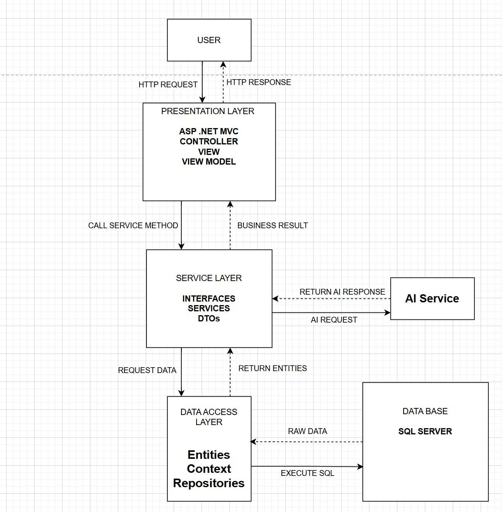

# 🤖 Chatbot RAG System — PRN222 Assignment

Ứng dụng web ASP.NET Core tích hợp Python AI Microservice để xây dựng hệ thống **Retrieval-Augmented Generation (RAG)** chatbot. Hỗ trợ chat thời gian thực, quản lý tài liệu và phân quyền theo vai trò.

## 🚀 Tính năng

- **N-Tier Architecture** — Tách biệt rõ ràng Presentation / Service / DataAccess layers
- **Real-time Chat** — Sử dụng ASP.NET Core SignalR
- **RAG Pipeline** — Tích hợp embedding microservice, trả lời dựa trên tài liệu được upload
- **Document Management** — Upload, trích xuất, chunking tài liệu (.pdf, .docx, .pptx)
- **Python AI Service** — FastAPI + `sentence-transformers` (`intfloat/multilingual-e5-base`)
- **Auth & Authorization** — ASP.NET Core Identity + Google OAuth + phân quyền Admin/Teacher/Student
- **Database** — Entity Framework Core + SQL Server

## 🏗️ Kiến trúc



```
PresentationLayer/    ← Razor Pages, SignalR Hubs, Program.cs
ServiceLayer/         ← Business Logic (Chat, RAG, Document, Benchmark)
DataAccessLayer/      ← EF Core DbContext, Repositories, Entities, Migrations
PythonAIService/      ← FastAPI embedding server (Python)
```

## 🛠️ Tech Stack

| Thành phần | Công nghệ |
|-----------|-----------|
| Backend | C# .NET 8, ASP.NET Core Razor Pages |
| Real-time | SignalR |
| ORM | Entity Framework Core |
| Database | SQL Server |
| AI Service | Python 3, FastAPI, Sentence Transformers |
| LLM | Groq API (`llama-3.3-70b-versatile`) |
| Auth | ASP.NET Core Identity, Google OAuth 2.0 |

---

## ⚙️ Hướng dẫn cài đặt và chạy

### Yêu cầu phần mềm

| Phần mềm | Version | Link |
|---------|---------|------|
| .NET SDK | 8.0+ | https://dotnet.microsoft.com/download |
| SQL Server | 2019+ (Express được) | https://www.microsoft.com/en-us/sql-server/sql-server-downloads |
| Python | 3.10+ | https://www.python.org/downloads/ |
| Git | Any | https://git-scm.com/ |

---

### Bước 1 — Clone repository

```bash
git clone https://github.com/hoanglhse173120/PRN222.git
cd PRN222
```

---

### Bước 2 — Cấu hình biến môi trường

> ⚠️ File `.env` **không được commit lên GitHub** vì chứa API key và mật khẩu. Bạn phải tự tạo file này.

Copy file mẫu và điền thông tin của bạn:

```bash
# Windows PowerShell
Copy-Item PresentationLayer\.env.example PresentationLayer\.env
```

Mở file `PresentationLayer\.env` và điền các giá trị:

```env
# Kết nối SQL Server — thay <SERVER_NAME>, <USERNAME>, <PASSWORD>
ConnectionStrings__DefaultConnection=Server=<SERVER_NAME>;Database=ChatbotRBLDb;uid=<USERNAME>;pwd=<PASSWORD>;TrustServerCertificate=True;MultipleActiveResultSets=true

# Groq API Key — lấy tại https://console.groq.com/
Groq__ApiKey=gsk_...
Groq__Model=llama-3.3-70b-versatile

# Google OAuth (tuỳ chọn, để trống nếu không dùng)
Authentication__Google__ClientId=
Authentication__Google__ClientSecret=

# Python service URL (giữ mặc định nếu chạy local)
Rag__EmbedApiUrl=http://127.0.0.1:8000/embed
Rag__TopK=5
Rag__MinScore=0.6
```

**Lấy Groq API Key:**
1. Truy cập https://console.groq.com/
2. Đăng ký tài khoản miễn phí
3. Vào **API Keys** → **Create API Key**
4. Copy key vào file `.env`

---

### Bước 3 — Tạo Database & chạy Migration

Mở **SQL Server Management Studio** hoặc dùng terminal, đảm bảo SQL Server đang chạy.

```powershell
# Chạy từ thư mục gốc (PRN222/)
dotnet ef database update --project DataAccessLayer --startup-project PresentationLayer
```

Lệnh này sẽ tự động tạo database `ChatbotRBLDb` và tất cả các bảng.

> 💡 **Tip:** Nếu gặp lỗi `dotnet ef not found`, cài tool:
> ```bash
> dotnet tool install --global dotnet-ef
> ```

**Tài khoản mặc định** (được seed tự động khi app khởi động lần đầu):

| Email | Password | Role |
|-------|----------|------|
| admin@chatbot.com | Admin@123456 | Admin |
| teacher@test.com | Teacher@123 | Teacher |
| student@test.com | Student@123 | Student |

---

### Bước 4 — Khởi động Python AI Service

> ⚠️ Phải chạy service này **trước** khi khởi động C# app. Nếu không, tính năng index tài liệu và RAG sẽ không hoạt động.

```powershell
# Di chuyển vào thư mục Python service
cd PythonAIService

# Tạo virtual environment
python -m venv venv

# Kích hoạt venv (Windows)
.\venv\Scripts\activate

# Cài đặt dependencies
pip install -r requirements.txt

# Khởi động server (lần đầu tải model ~1GB, cần đợi)
python -m uvicorn main:app --host 127.0.0.1 --port 8000 --reload
```

Khi thấy log `Application startup complete.` là service đã sẵn sàng.

---

### Bước 5 — Khởi động ASP.NET Core Web App

Mở **terminal mới** (giữ terminal Python vẫn chạy):

```powershell
# Di chuyển vào thư mục Presentation
cd PresentationLayer

dotnet run
```

Truy cập ứng dụng tại: **https://localhost:7xxx** hoặc **http://localhost:5xxx** (xem URL trong console output).

---

## 🔧 Troubleshooting

### ❌ App crash với lỗi "Connection string empty"
→ File `.env` chưa được tạo hoặc đặt sai vị trí. Đảm bảo file nằm tại `PresentationLayer/.env`.

### ❌ Migration lỗi "Cannot open database"
→ Kiểm tra SQL Server đang chạy và thông tin kết nối trong `.env` đúng.

### ❌ RAG không hoạt động / lỗi khi index tài liệu
→ Python service chưa chạy. Chạy Bước 4 trước, đảm bảo server đang lắng nghe tại `http://127.0.0.1:8000`.

### ❌ `dotnet ef` không tìm thấy
→ Chạy: `dotnet tool install --global dotnet-ef`

### ❌ Lỗi login Google OAuth
→ Để trống `Authentication__Google__ClientId` và `ClientSecret` trong `.env` để bỏ qua Google login. Dùng tài khoản local thay thế.

---

## 👥 Tài khoản test mặc định

Sau khi chạy migration và khởi động app, các tài khoản sau được tạo tự động:

| Role | Email | Password |
|------|-------|----------|
| **Admin** | admin@chatbot.com | Admin@123456 |
| **Teacher** | teacher@test.com | Teacher@123 |
| **Student** | student@test.com | Student@123 |

---

## 📝 Notes

- File `PresentationLayer/appsettings.json` chỉ chứa cấu hình mặc định (trống). Mọi secret được load từ `.env` qua `DotNetEnv`.
- File `DataAccessLayer/Entities/ChatbotRbldbContext.cs` được scaffold từ database và bị ignore bởi git. Nếu cần regenerate, dùng `dotnet ef dbcontext scaffold`.
